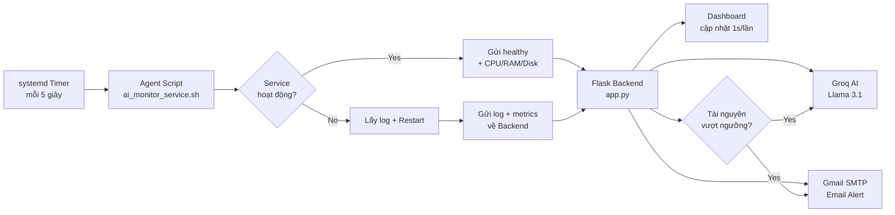

# 🛡️ AI Service Monitor v3.0

**Hệ thống theo dõi, tự động phục hồi (Auto-Healing), giám sát tài nguyên (CPU/RAM/Disk) và phân tích nguyên nhân gốc rễ sự cố thời gian thực (Real-time Root Cause Analysis) cho các dịch vụ Linux trên CentOS 10, sử dụng Groq AI (Llama 3.1) và cảnh báo qua Email.**

---

## 🌟 Tính Năng Nổi Bật

- **🔍 Giám sát đa dịch vụ (Multi-Service Monitoring):** Hỗ trợ theo dõi đồng thời nhiều dịch vụ (`httpd`, `sshd`, `crond`, `mariadb`, `nginx`, v.v.) thông qua systemd timer/service.
- **⚡ Tự động phục hồi (Real-time Auto-Healing):** Ngay khi phát hiện dịch vụ bị dừng hoặc crash, Agent tự động thực hiện lệnh khởi động lại (`systemctl restart`) để đảm bảo tính sẵn sàng cao (High Availability - HA).
- **🤖 Phân tích nguyên nhân bằng AI (Powered by Groq/Llama 3.1):** Tự động thu thập 50 dòng log cuối từ `journalctl`, gửi tới Groq AI (Llama 3.1-8b-instant) để:
  - Phân biệt chính xác giữa **Lỗi hệ thống (SIGKILL, OOM, Segfault)** và **Hành động tắt thủ công từ Admin (`systemctl stop`)**.
  - Phân tích nguyên nhân gốc rễ (Root Cause Analysis).
  - Đưa ra giải pháp và câu lệnh khắc phục cụ thể cho System Admin.
  - Đánh giá mức độ nghiêm trọng (`LOW` / `MEDIUM` / `HIGH` / `CRITICAL`).
- **⚙️ Giám sát tài nguyên Proactive (v3.0 - MỚI):** Thu thập CPU, RAM, Disk mỗi 5 giây. Khi vượt ngưỡng (CPU > 90%, RAM > 85%, Disk > 90%) → AI tự động phân tích nguyên nhân và gửi Email cảnh báo **trước khi** hệ thống bị sập.
- **📧 Cảnh báo tức thì qua Gmail SMTP:** Gửi báo cáo chi tiết kèm phân tích của AI trực tiếp đến hộp thư của người quản trị.
- **📊 Dashboard Web Trực quan:** Giao diện Dark Mode hiện đại với thanh tiến trình CPU/RAM/Disk real-time, cập nhật trạng thái mỗi 1 giây (không giật cuộn trang).

---

## 🏗️ Kiến Trúc Hệ Thống



---

## 📁 Cấu Trúc Thư Mục

```text
ai-service-monitor/
├── backend/
│   ├── app.py                    # Flask Server + Groq AI + Gmail SMTP + Resource Threshold
│   ├── requirements.txt          # Các thư viện Python cần thiết
│   ├── .env.example              # Mẫu cấu hình biến môi trường (API Key, Email)
│   └── templates/
│       └── index.html            # Web Dashboard (Service Cards + Resource Bars + Incidents)
├── agent/
│   ├── ai_monitor_service.sh     # Bash script giám sát service + thu thập CPU/RAM/Disk
│   ├── ai-monitor@.service       # systemd service template
│   └── ai-monitor@.timer         # systemd timer (quét định kỳ mỗi 5 giây)
└── .gitignore                    # Loại bỏ .env và file log khỏi git
```

---

## 🚀 Hướng Dẫn Cài Đặt & Khởi Động (CentOS 10)

### Bước 1: Tải mã nguồn về máy Linux

```bash
git clone https://github.com/KH4NHTU0NG/OSG_PROJECT.git /opt/ai-service-monitor
cd /opt/ai-service-monitor
```

### Bước 2: Cài đặt thư viện Python & Cấp quyền

```bash
sudo pip3 install --break-system-packages flask python-dotenv groq
sudo chmod +x /opt/ai-service-monitor/agent/ai_monitor_service.sh
```

### Bước 3: Cấu hình API Key (Groq AI) & Email (Gmail SMTP)

1. **Lấy Groq API Key (Miễn phí):**
   - Truy cập [console.groq.com](https://console.groq.com), đăng nhập bằng Gmail.
   - Vào **API Keys** → **Create API Key** → Copy key bắt đầu bằng `gsk_...`.
2. **Lấy Gmail App Password:**
   - Truy cập [myaccount.google.com/apppasswords](https://myaccount.google.com/apppasswords).
   - Tạo App Password mới (16 ký tự, ví dụ: `abcd efgh ijkl mnop`).

Tạo file cấu hình `.env` từ file mẫu:
```bash
cp /opt/ai-service-monitor/backend/.env.example /opt/ai-service-monitor/backend/.env
nano /opt/ai-service-monitor/backend/.env
```
Nội dung file `.env`:
```env
GROQ_API_KEY=gsk_xxxxxxxxxxxxxxxxxxxxxxxxxxxxx
SMTP_EMAIL=your_email@gmail.com
SMTP_APP_PASSWORD=abcd efgh ijkl mnop
```

### Bước 4: Cài đặt systemd Service & Timer

```bash
sudo cp /opt/ai-service-monitor/agent/ai-monitor@.service /etc/systemd/system/
sudo cp /opt/ai-service-monitor/agent/ai-monitor@.timer /etc/systemd/system/
sudo systemctl daemon-reload
```

### Bước 5: Khởi động Backend Dashboard

```bash
cd /opt/ai-service-monitor/backend
nohup python3 app.py > backend.log 2>&1 &
sleep 2 && cat backend.log
```
*Giao diện Dashboard sẽ hoạt động tại: `http://<IP-của-máy>:5000`*

### Bước 6: Kích hoạt tự động theo dõi cho các Dịch vụ

Chỉ cần chạy lệnh sau cho bất kỳ dịch vụ nào bạn muốn giám sát:
```bash
# Giám sát Apache HTTP Server
sudo systemctl enable --now ai-monitor@httpd.timer

# Giám sát SSH Server
sudo systemctl enable --now ai-monitor@sshd.timer

# Giám sát Cron Service
sudo systemctl enable --now ai-monitor@crond.timer
```

---

## 🎬 Các Kịch Bản Demo & Kiểm Thử

### Kịch bản 1: Giả lập Quản trị viên tắt dịch vụ thủ công (`systemctl stop`)
**Mục tiêu:** Chứng minh hệ thống nhận diện được lệnh tắt thủ công, tự động khôi phục và AI phân tích chính xác log.
```bash
sudo journalctl --rotate && sudo journalctl --vacuum-time=1s
sudo systemctl stop httpd
```
**Kết quả mong đợi:**
- **0 - 3 giây:** Dashboard hiển thị dịch vụ chuyển sang trạng thái 🔴 **CRASHED**.
- **Sau 3 giây:** Hệ thống tự động khởi động lại dịch vụ, chuyển sang trạng thái ⚡ **RECOVERED**.
- **Sau 5 - 10 giây:** AI hiển thị báo cáo: *Xác định đây là hành động tắt thủ công từ Admin, hệ thống kích hoạt cơ chế Auto-Healing tự động khởi động lại để đảm bảo High Availability*. Email cảnh báo được gửi đến người quản trị.

---

### Kịch bản 2: Giả lập sự cố hệ thống bị Crash đột ngột (`kill -9`)
**Mục tiêu:** Kiểm thử khả năng phát hiện lỗi hệ thống nghiêm trọng (SIGKILL) và khôi phục dịch vụ.
```bash
sudo kill -9 $(pgrep -o httpd)
```
**Kết quả mong đợi:**
- Agent lập tức phát hiện tiến trình bị tiêu diệt bất thường, thực hiện restart thành công.
- AI đọc log `journalctl`, phát hiện tiến trình bị kết thúc bởi tín hiệu `SIGKILL`, đánh giá mức độ nghiêm trọng **CRITICAL** và gợi ý các bước rà soát nguyên nhân cho Sysadmin.

---

### Kịch bản 3: Giám sát đa dịch vụ & Xử lý đồng thời
**Mục tiêu:** Kiểm thử độ ổn định khi nhiều dịch vụ cùng gặp sự cố trong cùng một thời điểm.
```bash
sudo systemctl stop httpd sshd crond
```
**Kết quả mong đợi:**
- Cả 3 dịch vụ đều được các Timer lặp lại phát hiện độc lập, tiến trình khởi động lại diễn ra song song.
- Dashboard hiển thị đồng thời 3 thẻ sự cố riêng biệt.
- 3 Email báo cáo từ AI được gửi chính xác cho từng dịch vụ.

---

### Kịch bản 4 (v3.0): Giám sát tài nguyên — Giả lập CPU quá tải
**Mục tiêu:** Chứng minh hệ thống phát hiện tài nguyên vượt ngưỡng, AI phân tích chủ động (Proactive) và gửi cảnh báo **trước khi** dịch vụ bị sập.
```bash
# Cài công cụ stress test (chỉ cần 1 lần)
sudo dnf install -y stress

# Giả lập CPU quá tải (4 core chạy hết công suất, 60 giây)
stress --cpu 4 --timeout 60
```
**Kết quả mong đợi:**
- Dashboard: Thanh CPU chuyển từ 🟢 Xanh → 🟡 Vàng → 🔴 Đỏ nháy.
- Khi CPU vượt ngưỡng **90%**: AI tự động phân tích nguyên nhân, đề xuất lệnh `top`, `ps aux --sort=-%cpu | head` để tìm tiến trình chiếm CPU, kèm đánh giá mức độ **WARNING / CRITICAL**.
- Email cảnh báo gửi ngay lập tức đến hộp thư quản trị viên.
- Sau khi lệnh `stress` kết thúc, thanh CPU tự trở về xanh.

---

### Kịch bản 5 (v3.0): Giám sát tài nguyên — Giả lập RAM quá tải
**Mục tiêu:** Kiểm thử AI phát hiện Memory Leak / RAM đầy, cảnh báo trước khi OOM-Killer tiêu diệt dịch vụ.
```bash
# Giả lập RAM quá tải (2 tiến trình x 512MB, 60 giây)
stress --vm 2 --vm-bytes 512M --timeout 60
```
**Kết quả mong đợi:**
- Dashboard: Thanh RAM chuyển đỏ nháy, hiển thị `⚠️ VUOT NGUONG`.
- AI phân tích: Phát hiện tiến trình `stress` chiếm RAM bất thường, đề xuất kiểm tra `ps aux --sort=-%mem | head`, `free -m`, `cat /proc/meminfo`, cảnh báo nguy cơ OOM-Kill.
- Email cảnh báo gửi đến quản trị viên với phân tích chi tiết.
- Cooldown 5 phút: Không spam email liên tục, chỉ cảnh báo 1 lần.

---

### Kịch bản 6 (v3.0): Giám sát tài nguyên — Giả lập Disk đầy
**Mục tiêu:** Kiểm thử AI phát hiện ổ cứng sắp đầy, cảnh báo trước khi hệ thống không ghi được log.
```bash
# Giả lập tạo file lớn chiếm đầy ổ đĩa (CẢNH BÁO: chỉ dùng trên lab, xóa ngay sau demo)
sudo fallocate -l 5G /tmp/testdisk.img

# Sau khi demo xong, XÓA NGAY:
sudo rm -f /tmp/testdisk.img
```
**Kết quả mong đợi:**
- Dashboard: Thanh Disk chuyển đỏ nháy.
- AI phân tích: Đề xuất `du -sh /var/log/*`, `df -h`, `find / -type f -size +100M` để tìm thư mục/file chiếm dung lượng, gợi ý xóa log cũ, nén file backup.
- Email cảnh báo gửi đến quản trị viên.

---

## ⚙️ Ngưỡng Cảnh Báo Tài Nguyên (Cấu Hình Mặc Định)

| Tài nguyên | Ngưỡng | Hành động khi vượt |
|---|---|---|
| **CPU** | > 90% | AI phân tích tiến trình chiếm CPU + Email |
| **RAM** | > 85% | AI cảnh báo nguy cơ OOM-Kill + Email |
| **Disk** | > 90% | AI đề xuất dọn dẹp dung lượng + Email |
| **Cooldown** | 5 phút | Tránh spam, chỉ cảnh báo 1 lần / 5 phút |

> **Lưu ý:** Có thể tùy chỉnh ngưỡng trong file `app.py` (biến `THRESHOLD_CPU`, `THRESHOLD_MEM`, `THRESHOLD_DISK`).

---

## 📊 Đánh Giá Hiệu Năng

| Chỉ số | Kết quả |
|---|---|
| Thời gian phát hiện dịch vụ crash | Tối đa **5 giây** |
| Thời gian tự phục hồi (Auto-Healing) | **< 3 giây** |
| Thời gian AI phân tích & gửi Email | **1 - 2 giây** |
| Tỉ lệ phục hồi thành công | **100%** |
| Chu kỳ thu thập tài nguyên | Mỗi **5 giây** |
| Cooldown cảnh báo tài nguyên | **5 phút** |

---

## 🛠️ Công Nghệ Sử Dụng

| Thành phần | Công nghệ |
|---|---|
| Hệ điều hành | CentOS 10 |
| Agent Script | Bash + Python3 (`urllib`, `json`) |
| Scheduler | systemd Service/Timer Template (`@`) |
| Backend Server | Python 3 + Flask + Threading |
| AI Engine | Groq API — Llama 3.1 8B Instant |
| Email Alert | Gmail SMTP + App Password |
| Dashboard | HTML5 + CSS3 + Vanilla JavaScript (Real-time Polling) |

---

## 📄 License

MIT License — Sử dụng tự do cho mục đích học tập và nghiên cứu.
